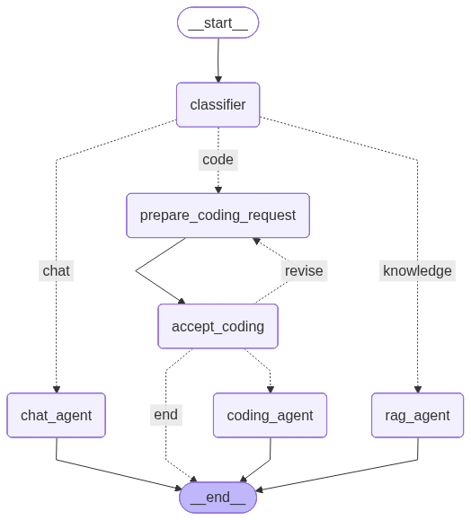

# langgraph-exercises

A LangGraph-based multi-intent chatbot that classifies user messages and routes them to specialized agents — chat, RAG, or an interactive coding assistant backed by Claude Code.

## Graph



## How it works

Every message passes through a `classifier` node that labels the intent, then routes to the appropriate agent:

| Intent      | Route                                        | Description                           |
|-------------|----------------------------------------------|---------------------------------------|
| `chat`      | `chat_agent`                                 | General-purpose conversation          |
| `knowledge` | `rag_agent`                                  | RAG over an in-memory knowledge base  |
| `code`      | `prepare_coding_request` → `accept_coding`   | Human-in-the-loop coding workflow     |

### Coding workflow (human-in-the-loop)

When the intent is `code`, the request goes through an interactive approval loop:

1. `prepare_coding_request` — formats the coding prompt
2. `accept_coding` — interrupts and presents the prompt to the user
   - **yes** → `coding_agent` runs `claude -p <prompt>` as a subprocess inside `workspace/`
   - **no** → ends the turn
   - **revised prompt** → loops back to `prepare_coding_request`

The coding agent delegates to Claude Code (`claude -p`) with `--permission-mode acceptEdits`, so any files it creates or edits land in `workspace/`.

### RAG knowledge base

The RAG agent uses an `InMemoryVectorStore` seeded with a small knowledge base covering LangGraph, LangChain, RAG, and related topics. It retrieves the top-3 relevant documents via similarity search and constrains the LLM to answer only from that context.

## Architecture

```
src/
  graphs/
    build_graph.py        # StateGraph wiring and compilation
  models/
    ModelFactory.py       # Creates chat and embedding models
    ModelInfo.py          # Model names/temperatures (enum)
  nodes/
    classify_intent.py    # Structured LLM output → intent label
    prompt_llm_chat.py    # Chat agent
    prompt_llm_rag.py     # RAG agent + vector store
    prepare_coding_request.py
    accept_coding.py      # Human interrupt node
    prompt_llm_code.py    # Runs claude -p as subprocess
  states/
    State.py              # TypedDict: messages, message_intent, next_node
    IntentClassifier.py   # Pydantic model for structured intent output
workspace/                # Working directory for Claude Code
main.py                   # Entry point — REPL loop, thread_id per session
```

### Model access

Controlled by the `MODEL_ACCESS` environment variable:

- `litellm` (default) — routes through a LiteLLM proxy using `OPENAI_API_KEY` / `OPENAI_BASE_URL`
- anything else (e.g. `direct`) — uses LangChain's `init_chat_model` directly with `ANTHROPIC_API_KEY`

Three model tiers are defined in `ModelInfo`: `default`, `advanced`, and `basic`.

### State

`State` is a `TypedDict` with:
- `messages` — append-only via LangGraph's `add_messages` reducer
- `message_intent` — set by the classifier, drives the first conditional edge
- `next_node` — set by `accept_coding` / `prepare_coding_request`, drives the coding branch

Conversation memory is persisted across turns with `InMemorySaver`, keyed by a `thread_id` UUID generated once per session.

## Setup

**Requirements:** Python 3.13+, [`uv`](https://docs.astral.sh/uv/)

```bash
# Install dependencies
uv sync

# Copy and populate environment variables
cp .env.example .env
```

Key environment variables:

| Variable            | Purpose                                           |
|---------------------|---------------------------------------------------|
| `MODEL_ACCESS`      | `litellm` for proxy, anything else for direct API |
| `ANTHROPIC_API_KEY` | Required for direct Anthropic access              |
| `OPENAI_API_KEY`    | Required for LiteLLM proxy                        |
| `OPENAI_BASE_URL`   | LiteLLM proxy base URL                            |

## Running

```bash
uv run python main.py
```

Type `exit` to quit the session.

## Dependencies

- [LangGraph](https://github.com/langchain-ai/langgraph) — graph orchestration and state management
- [LangChain](https://github.com/langchain-ai/langchain) — LLM abstractions and vector store
- [langchain-litellm](https://github.com/langchain-ai/langchain-litellm) — LiteLLM proxy integration
- [pydantic](https://docs.pydantic.dev/) — structured output models
- [python-dotenv](https://github.com/theskumar/python-dotenv) — environment variable loading
